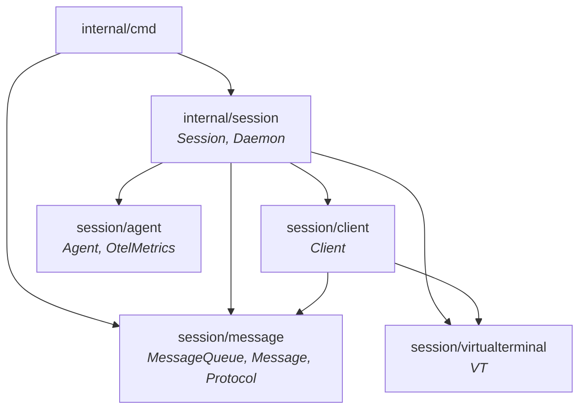
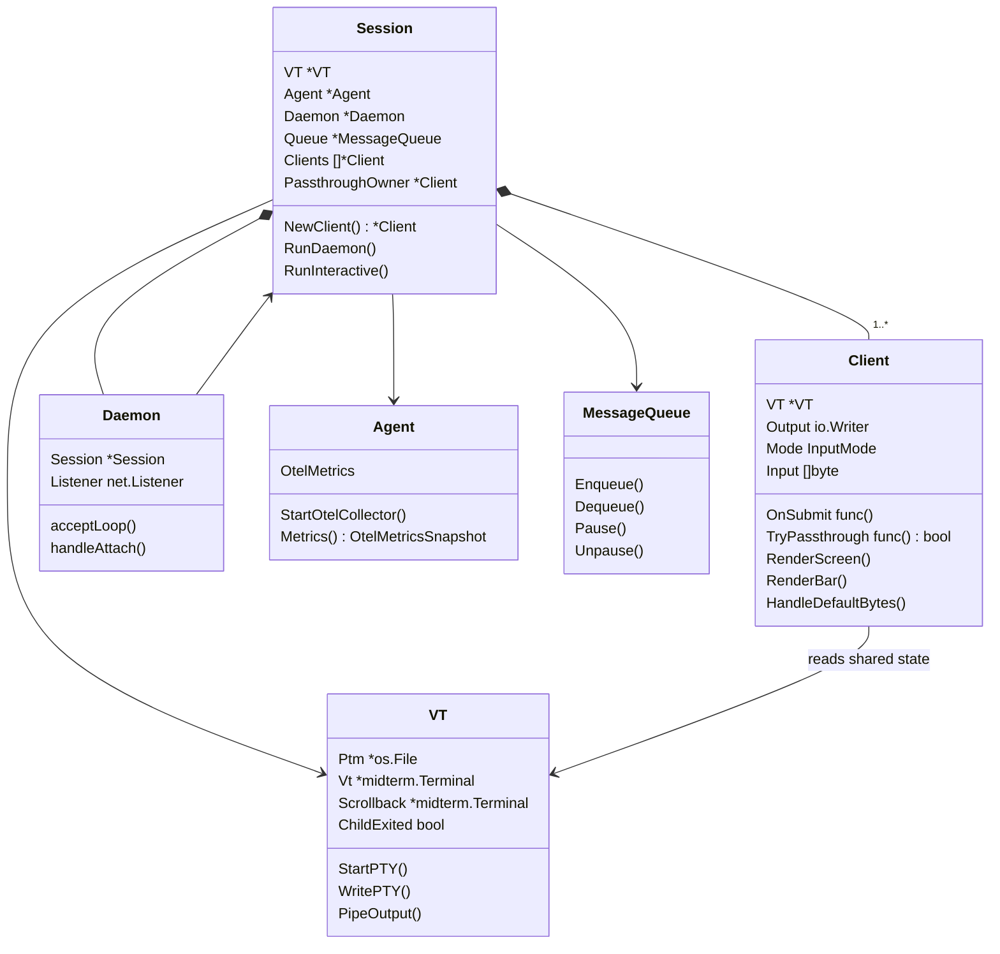

# Architecture

## Session Package Structure

The `internal/session/` package manages the terminal multiplexer: child process lifecycle, multi-client attach, input handling, rendering, and message delivery.

```
internal/session/
  session.go, daemon.go, attach.go, listener.go, names.go
  client/         — per-client UI state, input handling, rendering
  agent/          — OTEL collector, metrics, idle tracking
  message/        — message queue, priority delivery, wire protocol
  virtualterminal/ — PTY management, midterm buffers, child process
```

## Ownership Tree

```
Session (orchestrator, owns everything)
├── VT (PTY, midterm buffers, child process state)
├── Agent (OTEL collector, metrics, idle tracking)
├── Daemon (socket listener, attach/detach, process forking)
├── MessageQueue + Delivery
├── PassthroughOwner *Client
└── Clients []*Client
    └── Client
        ├── Output io.Writer (per-client: stdout or framed connection)
        ├── VT reference (reads shared terminal content)
        ├── Per-client state (mode, input, cursor, scroll, history, priority)
        └── Callbacks (OnSubmit, TryPassthrough, etc. — wired by Session)
```

## Dependency Graph



Leaf packages (`agent`, `message`, `virtualterminal`) have no internal imports.
`client` imports siblings but never the parent `session` package — reverse
dependencies are broken with callbacks that `session` wires at client creation.

## Key Types



## Data Flow

**Child output** — PTY writes to midterm buffers via `VT.PipeOutput`, which
calls back into Session. Session iterates all Clients and each one renders
to its own `Output` writer (stdout in interactive mode, framed connection in
daemon mode).

**User input** — Each client reads input independently. In interactive mode,
`Client.ReadInput` reads from stdin. In daemon mode, `Daemon.readClientInput`
reads framed data from the Unix socket. Input is dispatched to per-client
mode handlers (default, passthrough, menu, scroll).

**Message delivery** — Non-normal priority input goes through `MessageQueue`.
The delivery loop waits for idle state, then writes to the PTY. Passthrough
mode pauses the queue (only one client can hold passthrough at a time).

**Multi-client attach** — The daemon listens on a Unix socket. Each `h2 attach`
creates a new Client with its own output connection. Rendering is broadcast
to all clients. Passthrough is single-owner with lock/take-over semantics.
