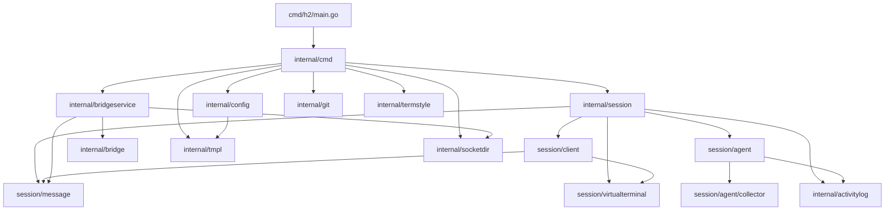

# h2 Architecture Overview

## What h2 Is

h2 is an agent runner, messaging, and orchestration layer for AI coding agents, written in Go. It wraps existing agent TUIs (Claude Code, Codex, etc.) by communicating through their TTY interface, acting as a terminal multiplexer purpose-built for AI agent management. It works with subscription plans (Claude Max, ChatGPT Pro) since it communicates through the same interface a human would -- no API keys required.

The system is organized into a 3-tier architecture: **Agent Runner** (launch/monitor/manage), **Messaging** (inter-agent and external communication), and **Orchestration** (roles, pods, coordinated teams).

## High-Level Architecture

```
                    ┌─────────────────────────────────────────────┐
                    │                 CLI Layer                    │
                    │            internal/cmd (Cobra)              │
                    │  run, attach, send, ls, stop, peek, pod...  │
                    └────────┬──────────────┬──────────────┬──────┘
                             │              │              │
              ┌──────────────┘              │              └──────────────┐
              ▼                             ▼                            ▼
   ┌─────────────────────┐    ┌─────────────────────┐    ┌──────────────────────┐
   │   Session Runtime    │    │   Configuration      │    │   Bridge Service      │
   │  internal/session    │    │  internal/config      │    │  internal/bridgeservice│
   │                      │    │                      │    │  internal/bridge       │
   │  Session + Daemon    │    │  Roles, Pods, Routes │    │  Telegram, macOS      │
   │  Client UI           │    │  Overrides, Templates│    │  Message routing      │
   │  Agent telemetry     │    │                      │    │                       │
   │  Message queue       │    │                      │    │                       │
   │  Virtual terminal    │    │                      │    │                       │
   └─────────┬────────────┘    └──────────┬───────────┘    └───────────┬──────────┘
             │                            │                            │
             │         Unix Domain Sockets (IPC)                       │
             ├─────────────────────────────┼───────────────────────────┤
             │                            │                            │
   ┌─────────┴────────┐    ┌──────────────┴───────────┐    ┌──────────┴──────────┐
   │  Utility Packages │    │   Child Process           │    │  External Services   │
   │                   │    │   (Claude Code, etc.)     │    │  (Telegram Bot API)  │
   │  socketdir        │    │                           │    │                      │
   │  tmpl             │    │  PTY ◄──► midterm VT100   │    │                      │
   │  git              │    │  OTEL ──► HTTP collector  │    │                      │
   │  activitylog      │    │  Hooks ──► h2 hook collect│    │                      │
   │  termstyle        │    │                           │    │                      │
   └───────────────────┘    └───────────────────────────┘    └──────────────────────┘
```

## Module Inventory

| Module | Path | LOC (non-test) | Responsibility |
|--------|------|----------------|----------------|
| **CLI commands** | `internal/cmd/` | ~4,500 | Cobra command tree, argument parsing, orchestration of all user-facing operations |
| **Session runtime** | `internal/session/` | ~700 | Session lifecycle, daemon socket server, client management, delivery orchestration |
| **Client UI** | `internal/session/client/` | ~1,200 | Per-client input handling, mode state machine, terminal rendering, scrollback |
| **Agent telemetry** | `internal/session/agent/` | ~850 | OTEL HTTP server, metrics aggregation, state machine, agent type abstraction |
| **Collectors** | `internal/session/agent/collector/` | ~450 | Hook, OTEL, and output-based state detection with priority hierarchy |
| **Message system** | `internal/session/message/` | ~550 | Priority queue, delivery loop, wire protocol, file-backed messages |
| **Virtual terminal** | `internal/session/virtualterminal/` | ~250 | PTY management, midterm buffers, OSC color proxying |
| **Configuration** | `internal/config/` | ~1,100 | h2 dir resolution, role/pod loading, template rendering, session setup |
| **Bridge interfaces** | `internal/bridge/` | ~450 | Bridge trait hierarchy, Telegram integration, macOS notifications, paging |
| **Bridge service** | `internal/bridgeservice/` | ~400 | Bridge daemon process, message routing, typing indicators |
| **Template engine** | `internal/tmpl/` | ~200 | Go text/template wrapper with variable definitions and custom functions |
| **Socket directory** | `internal/socketdir/` | ~150 | Socket naming, discovery, macOS path-length workaround |
| **Git integration** | `internal/git/` | ~120 | Worktree creation and reuse for agent branch isolation |
| **Activity logging** | `internal/activitylog/` | ~150 | Structured JSONL event logging per session |
| **Terminal styling** | `internal/termstyle/` | ~80 | TTY-aware ANSI coloring for CLI output |
| **Version** | `internal/version/` | ~10 | Version constant |

**Total:** ~36,800 lines including tests across ~85 Go source files.

## Dependency Graph



Leaf packages (`collector`, `message`, `virtualterminal`, `tmpl`, `socketdir`, `git`, `activitylog`, `termstyle`) have no internal imports. The `client` package imports `message` and `vt` but never the parent `session` -- reverse dependencies are broken with callbacks that `session` wires at client creation.

## Key External Dependencies

| Dependency | Purpose |
|------------|---------|
| `github.com/spf13/cobra` | CLI framework |
| `github.com/creack/pty` | PTY allocation and size control |
| `github.com/vito/midterm` | VT100/ANSI terminal emulation (the virtual terminal buffers) |
| `golang.org/x/term` | Raw terminal mode and state management |
| `github.com/muesli/termenv` | Terminal color detection and ANSI rendering |
| `gopkg.in/yaml.v3` | YAML configuration parsing |
| `github.com/google/uuid` | Message and session IDs |
| `github.com/gofrs/flock` | Cross-process file locking (routes registry) |
| `github.com/google/shlex` | Shell-style argument tokenization (bridge command execution) |

## Core Architectural Decisions

1. **Harness-agnostic via TTY**: h2 communicates with agents by writing to their PTY stdin and reading their PTY stdout. This means any TUI agent works -- no custom harness integration needed.

2. **Self-invocation daemon**: `h2 run` forks itself as `h2 _daemon` (a hidden subcommand) with `Setsid=true` to fully detach from the parent terminal. The daemon is the single source of truth for a session.

3. **Unix domain sockets for IPC**: All inter-process communication (attach, send, status, stop, hook events) uses the same JSON-over-Unix-socket protocol. Terminal data streaming uses binary length-prefixed framing on the same socket.

4. **Sandboxed configuration**: Each h2 directory is fully self-contained with its own roles, settings, hooks, CLAUDE.md files, and credentials. Different roles can use different `claude_config_dir` paths.

5. **Template-before-YAML rendering**: Role and pod files are Go templates that produce YAML. The `variables:` section is extracted via string manipulation before template rendering to avoid syntax conflicts.

6. **Priority-aware message queue**: Messages have four priority levels (interrupt > normal > idle-first > idle), with queue pausing during passthrough mode to prevent automated messages from interrupting interactive use.

7. **Committed-authority state detection**: The agent derives state from three collector sources (hooks > OTEL > output timing) using a priority hierarchy -- once a higher-fidelity source fires, it becomes the sole authority.

## Process Model

A typical h2 deployment consists of:

```
User terminal
  └── h2 run (exits after fork + attach)
        ├── h2 _daemon "coder-1"     ← agent session daemon (long-lived)
        │     └── claude ...          ← child agent process in PTY
        ├── h2 _daemon "coder-2"
        │     └── claude ...
        ├── h2 _daemon "reviewer"
        │     └── claude ...
        └── h2 _bridge-service       ← bridge daemon (long-lived)
              └── [Telegram long-poll goroutine]

User attaches via:
  h2 attach coder-1  ──── Unix socket ────► h2 _daemon "coder-1"
  Telegram bot        ──── bridge socket ──► h2 _bridge-service
                                               ──── agent socket ──► h2 _daemon "concierge"
```

Each `h2 _daemon` is an independent process with its own PTY, OTEL collector, hook receiver, message queue, and socket listener. The bridge daemon routes messages between agents and external platforms. All processes communicate via Unix domain sockets in `~/.h2/sockets/`.
