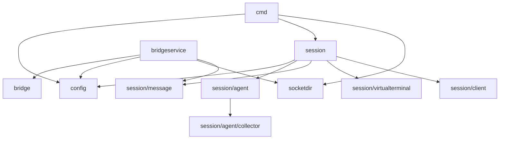
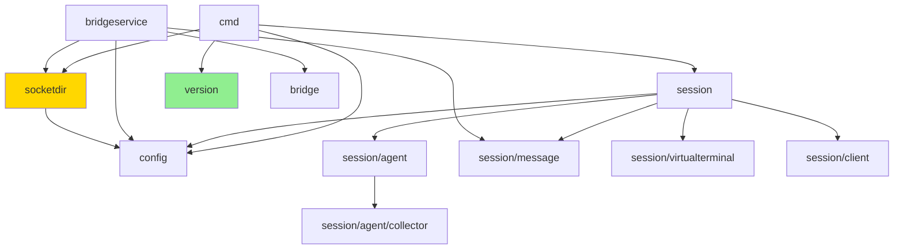
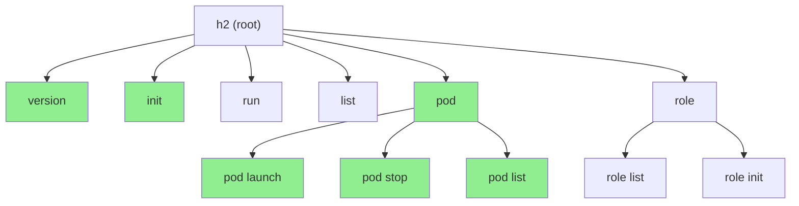
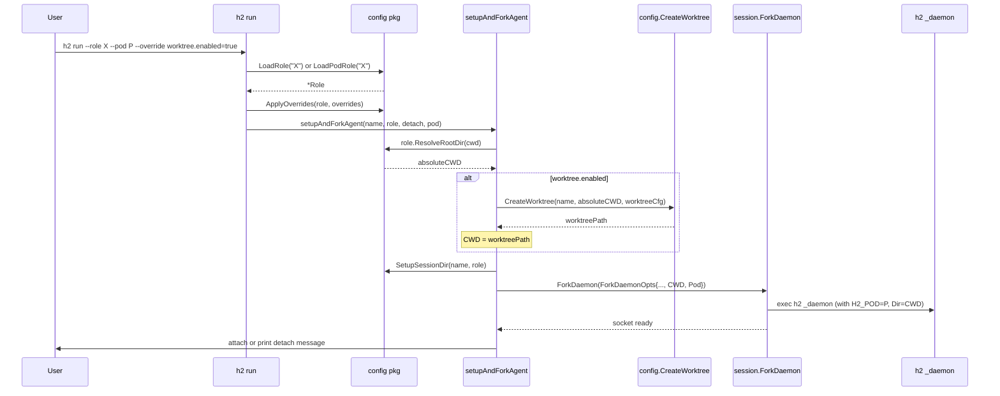
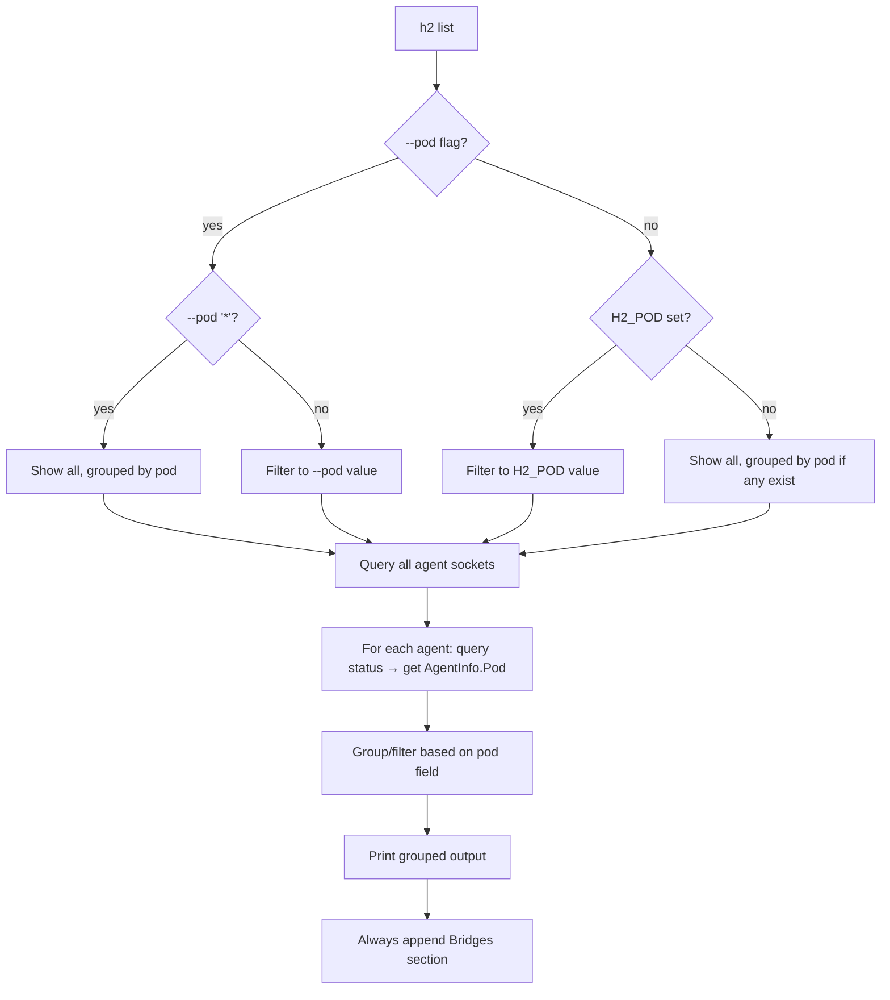

# Technical Design: H2 Dir, Pods, and Worktrees

Companion to `h2-dir-pods-worktrees.md`. This document covers data model changes, package interactions, environment variables, and config mappings.

---

## 1. Data Model Changes

### 1.1 New: `internal/version/version.go`

New package with a single constant:

```go
package version

const Version = "0.1.0"
```

Referenced by `h2 version` command and `h2 init` (writes to `.h2-dir.txt`).

### 1.2 Modified: `internal/config/config.go`

**Current** `ConfigDir()`:
```go
func ConfigDir() string {
    home, err := os.UserHomeDir()
    if err != nil {
        return filepath.Join(".", ".h2")
    }
    return filepath.Join(home, ".h2")
}
```

**New** `ConfigDir()` with resolution chain:

```go
// ResolveDir finds the h2 root directory.
// Order: H2_DIR env var → walk up CWD → ~/.h2/ fallback.
func ResolveDir() (string, error)

// ConfigDir returns the resolved h2 dir or panics.
// Retained for backward compatibility with existing callers.
func ConfigDir() string
```

New helper:

```go
// IsH2Dir checks if dir contains a valid .h2-dir.txt marker file.
func IsH2Dir(dir string) bool

// ReadMarkerVersion reads the version string from .h2-dir.txt.
func ReadMarkerVersion(dir string) (string, error)

// WriteMarker writes .h2-dir.txt with the current version.
func WriteMarker(dir string) error
```

**All existing derived path functions** (`RolesDir()`, `SessionsDir()`, `DefaultClaudeConfigDir()`) remain unchanged -- they call `ConfigDir()` internally, so they automatically use the resolved dir.

### 1.3 Modified: `internal/socketdir/socketdir.go`

**Current** `Dir()`:
```go
func Dir() string {
    return filepath.Join(os.Getenv("HOME"), ".h2", "sockets")
}
```

**New**: derive from config:
```go
func Dir() string {
    return filepath.Join(config.ConfigDir(), "sockets")
}
```

This means `socketdir` gains an import on `config`. Currently it has no internal imports.

### 1.4 Modified: `internal/config/role.go` — Role struct

New fields added:

```go
type Role struct {
    // ... existing fields ...

    RootDir  string          `yaml:"root_dir,omitempty"`  // agent CWD (default ".")
    Worktree *WorktreeConfig `yaml:"worktree,omitempty"`  // git worktree settings
}

type WorktreeConfig struct {
    Enabled         bool   `yaml:"enabled"`
    BranchFrom      string `yaml:"branch_from,omitempty"`      // default: "main"
    UseDetachedHead bool   `yaml:"use_detached_head,omitempty"` // default: false
}
```

New method:

```go
// ResolveRootDir returns the absolute path for the agent's working directory.
// "." is interpreted as invocationCWD. Relative paths are resolved against
// the h2 dir. Absolute paths are used as-is.
func (r *Role) ResolveRootDir(invocationCWD string) (string, error)
```

### 1.5 Modified: `internal/config/session_dir.go` — SessionMetadata

New fields to record overrides and pod:

```go
type SessionMetadata struct {
    // ... existing fields ...

    Pod       string            `json:"pod,omitempty"`       // H2_POD value
    Overrides map[string]string `json:"overrides,omitempty"` // --override key=value pairs
}
```

### 1.6 Modified: `internal/session/daemon.go` — ForkDaemon

Refactor from many positional args to an options struct:

**Current signature** (8 positional args):
```go
func ForkDaemon(name, sessionID, command string, args []string,
    roleName, sessionDir, claudeConfigDir string, heartbeat DaemonHeartbeat) error
```

**New signature** with opts struct:
```go
type ForkDaemonOpts struct {
    Name            string
    SessionID       string
    Command         string
    Args            []string
    RoleName        string
    SessionDir      string
    ClaudeConfigDir string
    Heartbeat       DaemonHeartbeat
    CWD             string // NEW: working directory for the child process
    Pod             string // NEW: pod name (set as H2_POD env var)
}

func ForkDaemon(opts ForkDaemonOpts) error
```

`RunDaemon` should be refactored similarly since it mirrors the same parameters.

`opts.CWD` is set via `cmd.Dir` on the exec.Command before starting.
Environment is built explicitly: `cmd.Env = append(os.Environ(), "H2_POD="+opts.Pod, "H2_DIR="+resolvedDir)`. Note: once `cmd.Env` is set, Go no longer inherits the parent env implicitly, so `os.Environ()` must be included as the base.

### 1.7 Modified: `internal/session/message/protocol.go` — AgentInfo

New field:

```go
type AgentInfo struct {
    // ... existing fields ...

    Pod string `json:"pod,omitempty"` // pod name from H2_POD
}
```

Populated in `Daemon.AgentInfo()` by reading `os.Getenv("H2_POD")`.

### 1.8 New: `internal/config/pods.go`

Pod role resolution and template loading:

```go
// PodRolesDir returns <h2-dir>/pods/roles/.
func PodRolesDir() string

// PodTemplatesDir returns <h2-dir>/pods/templates/.
func PodTemplatesDir() string

// LoadPodRole loads a role, checking pod roles first then global roles.
// Only called when --pod is specified. Without --pod, use LoadRole() (global only).
func LoadPodRole(name string) (*Role, error)

// ListPodRoles returns roles from <h2-dir>/pods/roles/.
func ListPodRoles() ([]*Role, error)

type PodTemplate struct {
    PodName string             `yaml:"pod_name"`
    Agents  []PodTemplateAgent `yaml:"agents"`
}

type PodTemplateAgent struct {
    Name string `yaml:"name"`
    Role string `yaml:"role"`
}

// LoadPodTemplate loads a template from <h2-dir>/pods/templates/<name>.yaml.
func LoadPodTemplate(name string) (*PodTemplate, error)

// ListPodTemplates returns available pod templates.
func ListPodTemplates() ([]*PodTemplate, error)
```

### 1.9 New: `internal/config/worktree.go`

Git worktree operations:

```go
// WorktreesDir returns <h2-dir>/worktrees/.
func WorktreesDir() string

// CreateWorktree creates a git worktree for an agent.
// Returns the absolute path to the new worktree.
func CreateWorktree(agentName, repoDir string, cfg *WorktreeConfig) (string, error)
```

Implementation calls `git worktree add` with appropriate flags:
- Default: `git worktree add -b <agent-name> <worktree-path> <branch_from>`
- Detached: `git worktree add --detach <worktree-path> <branch_from>`

### 1.10 New: `internal/config/override.go`

Role override application:

```go
// ApplyOverrides applies --override key=value pairs to a loaded Role.
// Keys use dot notation (e.g. "worktree.enabled", "root_dir").
// Returns an error for unknown keys or type mismatches.
func ApplyOverrides(role *Role, overrides []string) error
```

Implementation uses reflection on the Role struct, splitting on `.` for nested access. Supported types: `string`, `bool`, `int`, `*bool`.

---

## 2. Package Dependency Changes

### 2.1 Current package imports



### 2.2 New package imports after changes



Key changes:
- **New package**: `internal/version` (no imports, imported by `cmd`)
- **New import**: `socketdir` → `config` (to derive socket dir from resolved h2 dir)
- **New files in config**: `pods.go`, `worktree.go`, `override.go`

### 2.3 New command registration



---

## 3. Agent Startup Flow (after changes)

Note: `setupAndForkAgent` is refactored to accept a `*Role` (after overrides are applied) instead of a role name string. Role loading and override application happen in the command handler before calling setup.



---

## 4. Environment Variables

| Variable | Set by | Read by | Purpose |
|----------|--------|---------|---------|
| `H2_DIR` | User (shell) | `config.ResolveDir()` | Override h2 root directory |
| `H2_POD` | `ForkDaemon` (on child) | `Daemon.AgentInfo()`, `h2 list`, `h2 run` | Pod membership for agent |
| `CLAUDE_CONFIG_DIR` | `ForkDaemon` (on child) | Claude Code | Claude config isolation per role |
| `CLAUDE_CODE_ENABLE_TELEMETRY` | Agent type (on child) | Claude Code | Enable OTEL telemetry |
| `OTEL_*` | Agent type (on child) | Claude Code | OTEL exporter configuration |

### Env var → config mapping

| Env Var | Config File Equivalent | Priority |
|---------|----------------------|----------|
| `H2_DIR` | None (no config equivalent) | Env var wins over directory walk |
| `H2_POD` | Pod template `pod_name` field | `--pod` flag > `H2_POD` env var > template default |

### Env vars passed to forked agents

Currently `ForkDaemon` does not explicitly set `cmd.Env`, so the child inherits the parent's full environment implicitly. After this change, `ForkDaemon` must explicitly build `cmd.Env` from `os.Environ()` plus additions (this is a change to the existing pattern). The additions are:

1. `H2_POD=<pod-name>` -- if pod is specified
2. `H2_DIR=<resolved-dir>` -- should be propagated so child `h2` commands resolve the same dir
3. `cmd.Dir = <cwd>` -- sets working directory (not an env var, but affects child behavior)

---

## 5. Config File Formats

### 5.1 `.h2-dir.txt` (marker file)

```
v0.1.0
```

Single line, version string. No YAML/JSON -- just plain text for simplicity and easy `cat` inspection.

### 5.2 Role YAML (updated schema)

```yaml
# Required
name: feature-builder
instructions: |
  You build features from specs.

# Optional (all have defaults)
description: "Builds features"          # human description
agent_type: claude                       # default: "claude"
model: ""                                # model override
root_dir: "."                            # CWD for agent (default: invocation CWD)
claude_config_dir: ""                    # custom claude config dir

# Optional blocks
permissions:
  allow: ["Bash(make build)", "Bash(make test)"]
  deny: []
  agent:
    enabled: true
    instructions: "Only allow safe operations"

heartbeat:
  idle_timeout: "10m"
  message: "Status update?"
  condition: ""

worktree:
  enabled: false                         # NEW
  branch_from: main                      # NEW
  use_detached_head: false               # NEW

hooks: {}                                # passed through to settings.json
settings: {}                             # extra settings.json keys
```

### 5.3 Pod template YAML

```yaml
pod_name: backend-team

agents:
  - name: feature-builder
    role: feature-builder
  - name: test-runner
    role: tester
  - name: reviewer
    role: code-reviewer
```

---

## 6. H2 Dir Resolution — Detailed Algorithm

```go
func ResolveDir() (string, error) {
    // 1. Check H2_DIR env var
    if dir := os.Getenv("H2_DIR"); dir != "" {
        abs, err := filepath.Abs(dir)
        if err != nil {
            return "", fmt.Errorf("H2_DIR: %w", err)
        }
        if !IsH2Dir(abs) {
            return "", fmt.Errorf("H2_DIR=%s is not an h2 directory (missing .h2-dir.txt)", abs)
        }
        return abs, nil
    }

    // 2. Walk up from CWD
    cwd, err := os.Getwd()
    if err != nil {
        return "", err
    }
    dir := cwd
    for {
        if IsH2Dir(dir) {
            return dir, nil
        }
        parent := filepath.Dir(dir)
        if parent == dir {
            break // reached filesystem root
        }
        dir = parent
    }

    // 3. Fall back to ~/.h2/
    home, err := os.UserHomeDir()
    if err != nil {
        return "", fmt.Errorf("cannot determine home directory: %w", err)
    }
    global := filepath.Join(home, ".h2")
    if IsH2Dir(global) {
        return global, nil
    }

    // 3a. Migration: auto-create marker for existing ~/.h2/ directories
    if looksLikeH2Dir(global) {
        WriteMarker(global)
        return global, nil
    }

    return "", fmt.Errorf("no h2 directory found; run 'h2 init' to create one")
}
```

### Migration helper

```go
// looksLikeH2Dir returns true if dir exists and contains expected h2 subdirectories,
// even without a .h2-dir.txt marker. Used for one-time migration of existing ~/.h2/.
func looksLikeH2Dir(dir string) bool {
    for _, sub := range []string{"roles", "sessions", "sockets"} {
        if _, err := os.Stat(filepath.Join(dir, sub)); err != nil {
            return false
        }
    }
    return true
}
```

### Caching

`ResolveDir()` should cache its result for the process lifetime (using `sync.Once`). The h2 dir doesn't change mid-process.

### Socket path length mitigation

Unix domain sockets have a max path length of ~104 bytes on macOS (`sizeof(sockaddr_un.sun_path)`). With project-local h2 dirs, socket paths can exceed this.

Mitigation in `socketdir.Dir()`:
1. Compute the full socket dir path: `<h2-dir>/sockets/`
2. If any potential socket path would exceed ~100 bytes, create a symlink from `/tmp/h2-<hash>/` (where hash is derived from the h2 dir path) pointing to the actual socket directory.
3. Return the symlink path instead.

This is transparent to all callers since they use `socketdir.Dir()` / `socketdir.Path()`.

---

## 7. Role Override Mechanism

### Supported override paths

The override mechanism maps dot-notation keys to struct fields via YAML tags:

| Override Key | Struct Path | Type |
|-------------|------------|------|
| `root_dir` | `Role.RootDir` | `string` |
| `agent_type` | `Role.AgentType` | `string` |
| `model` | `Role.Model` | `string` |
| `claude_config_dir` | `Role.ClaudeConfigDir` | `string` |
| `worktree.enabled` | `Role.Worktree.Enabled` | `bool` |
| `worktree.branch_from` | `Role.Worktree.BranchFrom` | `string` |
| `worktree.use_detached_head` | `Role.Worktree.UseDetachedHead` | `bool` |
| `heartbeat.idle_timeout` | `Role.Heartbeat.IdleTimeout` | `string` |
| `heartbeat.message` | `Role.Heartbeat.Message` | `string` |
| `heartbeat.condition` | `Role.Heartbeat.Condition` | `string` |

Nested structs (`Worktree`, `Heartbeat`) are auto-initialized if nil when an override targets them.

### Non-overridable fields

The following Role fields are excluded from the override mechanism:
- `name` -- role identity, not meaningful to change at runtime
- `instructions` -- too large for CLI; edit the YAML file instead
- `permissions` -- structured (allow/deny lists, agent block); not expressible as key=value
- `hooks` -- complex YAML node; not expressible as key=value
- `settings` -- complex YAML node; not expressible as key=value

`ApplyOverrides` returns an error if an override targets one of these fields.

### Type coercion rules

- `string`: used as-is
- `bool`: `"true"` / `"false"` (case-insensitive), anything else is an error
- `int`: parsed via `strconv.Atoi`
- `*bool`: same as `bool`, wrapped in pointer

---

## 8. Pod Discovery via `h2 list`

### How pod filtering works



### Status query flow for pod info

1. `h2 list` calls `socketdir.List()` to get all sockets
2. For each agent socket, connects and sends `Request{Type: "status"}`
3. Daemon responds with `AgentInfo` which now includes `Pod` field
4. `h2 list` groups agents by `AgentInfo.Pod` value

No new socket types, no pod registry -- just an env var and a field on the status response.

---

## 9. Worktree Creation Detail

### Git commands executed

```bash
# Default mode (new branch):
git -C <repo-dir> worktree add -b <agent-name> <h2-dir>/worktrees/<agent-name> <branch-from>

# Detached head mode:
git -C <repo-dir> worktree add --detach <h2-dir>/worktrees/<agent-name> <branch-from>
```

### Re-run behavior

If an agent with the same name is launched again after a previous run:
1. If the worktree directory already exists, **reuse it** — skip `git worktree add` and use the existing path as the agent's CWD.
2. If the worktree directory exists but is corrupt (missing `.git` file), error with a message suggesting manual cleanup.

This avoids requiring cleanup between agent restarts and lets agents pick up where they left off.

### Error conditions

- `root_dir` does not exist → error
- `root_dir` is not a git repo → error (check for `.git`)
- Worktree directory exists but is not a valid git worktree → error with cleanup instructions
- `branch_from` ref doesn't exist → git error, surfaced to user

---

## 10. `h2 init` Directory Creation

### Pseudocode

```go
func runInit(dir string) error {
    // Resolve target directory
    abs, _ := filepath.Abs(dir)

    // Check for existing marker
    if IsH2Dir(abs) {
        return fmt.Errorf("%s is already an h2 directory", abs)
    }

    // Create directory tree
    dirs := []string{
        abs,
        filepath.Join(abs, "roles"),
        filepath.Join(abs, "sessions"),
        filepath.Join(abs, "sockets"),
        filepath.Join(abs, "claude-config", "default"),
        filepath.Join(abs, "projects"),
        filepath.Join(abs, "worktrees"),
        filepath.Join(abs, "pods", "roles"),
        filepath.Join(abs, "pods", "templates"),
    }
    for _, d := range dirs {
        os.MkdirAll(d, 0755)
    }

    // Write marker
    WriteMarker(abs) // writes .h2-dir.txt with version

    // Write default config.yaml
    writeDefaultConfig(abs)

    fmt.Printf("Initialized h2 directory at %s\n", abs)
    return nil
}
```
