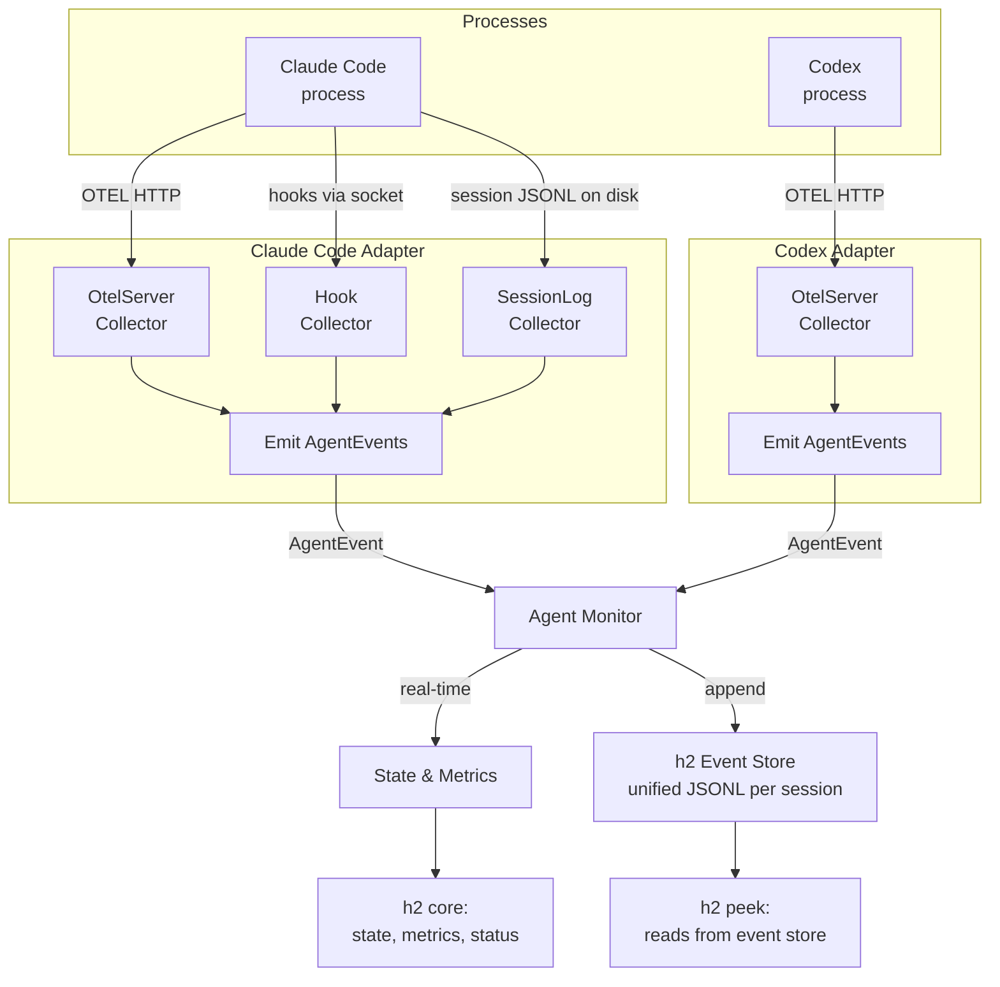
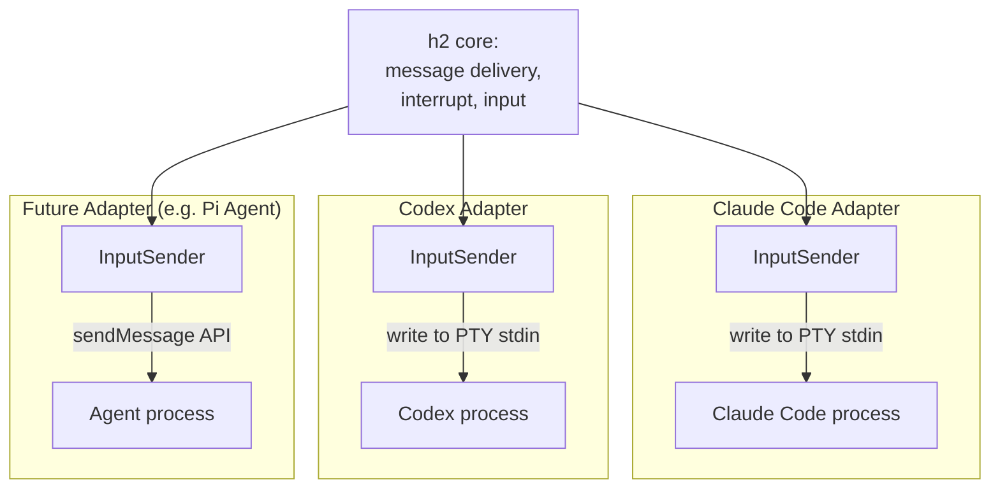

# Design Plan: Codex Agent Type + Agent Monitor Adapter Pattern

## Overview

Add OpenAI Codex CLI as a first-class agent type in h2, alongside Claude Code. More importantly, refactor agent observation into an **adapter pattern** so each agent type translates its native telemetry into a common set of agent events. This avoids h2 core needing to understand OTEL vs hooks vs JSON-RPC — it just consumes normalized events from an `AgentMonitor`.

The adapter also standardizes the **reverse direction** — how h2 delivers data back into agent processes. Today this is always PTY stdin, but future agent types may support other input methods (e.g. API calls, protocol messages).

### Architecture



### Reverse Direction (h2 → Agent)



## 1. AgentEvent — The Common Schema

A normalized event type that all adapters emit.

### Package: `internal/session/agent/monitor`

```go
// AgentEvent is the normalized event emitted by adapters.
type AgentEvent struct {
    Type      AgentEventType
    Timestamp time.Time
    Data      any // type-specific payload
}

type AgentEventType int

const (
    EventSessionStarted AgentEventType = iota
    EventTurnStarted
    EventTurnCompleted
    EventToolStarted
    EventToolCompleted
    EventApprovalRequested
    EventAgentMessage
    EventStateChange
    EventSessionEnded
)
```

**Event payloads:**

```go
type SessionStartedData struct {
    ThreadID string
    Model    string
}

type TurnCompletedData struct {
    TurnID       string
    InputTokens  int64
    OutputTokens int64
    CachedTokens int64
    CostUSD      float64
}

type ToolCompletedData struct {
    ToolName   string
    CallID     string
    DurationMs int64
    Success    bool
}

type StateChangeData struct {
    State    State
    SubState SubState
}
```

`State` and `SubState` types move into the `monitor` package (currently in `collector`). These are the core state types used throughout h2 — they belong with the monitor, not with any specific collector.

## 2. AgentAdapter Interface

### Package: `internal/session/agent/adapter`

```go
// AgentAdapter translates agent-specific telemetry into normalized AgentEvents.
type AgentAdapter interface {
    // Name returns the adapter identifier (e.g. "claude-code", "codex").
    Name() string

    // PrepareForLaunch returns env vars and CLI args to inject into the
    // child process so the adapter can receive telemetry from it.
    // Called before the agent process starts.
    PrepareForLaunch(agentName string) (LaunchConfig, error)

    // Start begins consuming agent-specific events and emitting AgentEvents.
    // Blocks until ctx is cancelled or the adapter encounters a fatal error.
    Start(ctx context.Context, events chan<- monitor.AgentEvent) error

    // HandleHookEvent processes a hook event received on the agent's Unix
    // socket. Not all adapters use hooks — return false if not handled.
    HandleHookEvent(eventName string, payload json.RawMessage) bool

    // Stop cleans up resources (HTTP servers, goroutines, etc).
    Stop()
}

// InputSender delivers input to an agent process.
// The default implementation writes to PTY stdin, but agent types
// with richer APIs can override this.
type InputSender interface {
    // SendInput delivers text input to the agent.
    SendInput(text string) error

    // SendInterrupt sends an interrupt signal (e.g. Ctrl+C).
    SendInterrupt() error
}

type LaunchConfig struct {
    Env         map[string]string // extra env vars for child process
    PrependArgs []string          // args to prepend before user args
}
```

### Key design points

- **HandleHookEvent**: The Daemon (socket listener) remains the single socket owner. On `hook_event` requests, it calls `adapter.HandleHookEvent()`. No dual-listener problem.
- **PrepareForLaunch**: Returns both env vars and args. For Claude Code: OTEL endpoint env vars + `--session-id`. For Codex: `-c 'otel.trace_exporter=...'` args.
- **Start**: Runs the adapter's internal event loop. Collectors (OTEL server, hook handler, etc.) live inside the adapter and feed into the events channel.
- **InputSender**: Standardizes the reverse direction. Default is PTY stdin write (works for Claude Code and Codex). Future agent types can implement richer input methods (e.g. `sendMessage()` API for Pi Agent).

## 3. Package Layout

```
internal/session/agent/
├── adapter/
│   ├── adapter.go             # AgentAdapter interface, InputSender, LaunchConfig
│   ├── claude/
│   │   ├── adapter.go         # ClaudeCodeAdapter
│   │   │                      # Owns: OtelServer + HookHandler + SessionLogCollector
│   │   ├── otel_parser.go     # Claude-specific OTEL log/metrics parsing
│   │   ├── hook_handler.go    # Hook event → AgentEvent translation
│   │   │                      # (state derivation: PreToolUse → thinking, etc.)
│   │   └── sessionlog.go      # Tails Claude's session JSONL, emits AgentEvents
│   │                          # (full message text, tool call details for peek)
│   └── codex/
│       ├── adapter.go         # CodexAdapter
│       │                      # Owns: OtelServer
│       └── otel_parser.go     # Codex-specific OTEL trace event parsing
├── shared/
│   ├── otelserver/
│   │   └── server.go          # Reusable OTEL HTTP server (binds random port,
│   │                          # accepts /v1/logs, /v1/metrics, /v1/traces,
│   │                          # dispatches raw payloads via callbacks)
│   ├── outputcollector/
│   │   └── output.go          # PTY output idle detector (always-on fallback)
│   └── eventstore/
│       └── store.go           # Append/read h2's unified AgentEvent JSONL
│                              # (one file per session, h2-controlled format)
├── monitor/
│   ├── events.go              # AgentEvent, AgentEventType, payload structs
│   ├── state.go               # State, SubState (moved from collector/)
│   └── monitor.go             # AgentMonitor: consumes events, updates
│                              # state/metrics, writes to EventStore
├── agent.go                   # Agent struct (owns AgentMonitor + OutputCollector)
├── agent_type.go              # AgentType interface (simplified)
└── otel_metrics.go            # OtelMetrics, OtelMetricsSnapshot (agent-agnostic)
```

### `shared/` — Reusable components

Adapter-agnostic building blocks that multiple adapters can compose:

**`shared/otelserver/`** — OTEL HTTP server that binds a random port and dispatches raw payloads via callbacks. Both Claude and Codex adapters embed this.

```go
type OtelServer struct {
    Port     int
    listener net.Listener
    server   *http.Server
}

type Callbacks struct {
    OnLogs    func(body []byte)
    OnMetrics func(body []byte)
    OnTraces  func(body []byte)
}

func New(cb Callbacks) (*OtelServer, error) { ... }
func (s *OtelServer) Stop() { ... }
```

**`shared/outputcollector/`** — PTY idle detector. Always created regardless of agent type. Monitors PTY output and emits active/idle based on a silence threshold. Feeds into the monitor as a fallback state source when the adapter doesn't provide precise state signals.

**`shared/eventstore/`** — Durable storage for normalized `AgentEvent`s. One JSONL file per session in h2's session directory. The `AgentMonitor` appends every event as it processes it. Peek reads from this store instead of parsing agent-native log formats directly.

```go
type EventStore struct {
    file *os.File
}

func Open(sessionDir string) (*EventStore, error) { ... }
func (s *EventStore) Append(event monitor.AgentEvent) error { ... }
func (s *EventStore) Read() ([]monitor.AgentEvent, error) { ... }
func (s *EventStore) Tail(ctx context.Context) (<-chan monitor.AgentEvent, error) { ... }
func (s *EventStore) Close() { ... }
```

This gives h2 full control over format, retention, and rotation — independent of how Claude Code or Codex store their own logs.

### Adapters compose shared components

Each adapter owns the collectors relevant to its agent type. All collectors within an adapter emit `AgentEvent`s into the adapter's output channel.

**Claude Code adapter** owns:
- `otelserver.OtelServer` — parses `/v1/logs` and `/v1/metrics` (token counts, tool results)
- Hook handler — translates hook events into state transitions (thinking, tool use, permission, etc.)
- Session log collector — tails Claude's session JSONL for full message text and tool call details (rich peek data that OTEL doesn't capture)

**Codex adapter** owns:
- `otelserver.OtelServer` — parses `/v1/traces` for Codex events (conversation starts, token counts, tool results)
- (Codex session log collector is a Phase 3 follow-up — see open questions)

## 4. Adapter Implementations

### Claude Code Adapter

Collectors: OtelServer + Hook handler + Session log tailer.

```go
type ClaudeCodeAdapter struct {
    otelServer      *otelserver.OtelServer
    hookHandler     *HookHandler
    sessionLogTail  *SessionLogCollector
    parser          *OtelParser
    activityLog     *activitylog.Logger
    sessionID       string
    events          chan<- monitor.AgentEvent // set in Start()
}

func (a *ClaudeCodeAdapter) PrepareForLaunch(agentName string) (adapter.LaunchConfig, error) {
    a.sessionID = uuid.New().String()
    return adapter.LaunchConfig{
        PrependArgs: []string{"--session-id", a.sessionID},
        Env: map[string]string{
            "CLAUDE_CODE_ENABLE_TELEMETRY": "1",
            "OTEL_EXPORTER_OTLP_ENDPOINT":  fmt.Sprintf("http://127.0.0.1:%d", a.otelServer.Port),
            // ... other OTEL env vars
        },
    }, nil
}

func (a *ClaudeCodeAdapter) Start(ctx context.Context, events chan<- monitor.AgentEvent) error {
    a.events = events
    // Start session log tailer — reads Claude's session JSONL for
    // full assistant messages and tool call content.
    // This is the primary source for peek data.
    go a.sessionLogTail.Run(ctx, events)
    // OTEL and hooks feed events via callbacks (not blocking here).
    <-ctx.Done()
    return nil
}

func (a *ClaudeCodeAdapter) HandleHookEvent(eventName string, payload json.RawMessage) bool {
    // Translate Claude hook events (PreToolUse, PostToolUse, SessionStart, etc.)
    // into AgentEvents and emit on a.events
    return true
}
```

### Codex Adapter

Collectors: OtelServer only (session log collector is a Phase 3 follow-up).

```go
type CodexAdapter struct {
    otelServer *otelserver.OtelServer
    parser     *OtelParser
    events     chan<- monitor.AgentEvent
}

func (a *CodexAdapter) PrepareForLaunch(agentName string) (adapter.LaunchConfig, error) {
    endpoint := fmt.Sprintf("http://127.0.0.1:%d", a.otelServer.Port)
    return adapter.LaunchConfig{
        PrependArgs: []string{
            "-c", fmt.Sprintf(`otel.trace_exporter={type="otlp-http",endpoint="%s"}`, endpoint),
        },
    }, nil
}

func (a *CodexAdapter) HandleHookEvent(eventName string, payload json.RawMessage) bool {
    return false // Codex doesn't use h2 hooks
}
```

Codex OTEL event → AgentEvent mapping:

| Codex OTEL Event | AgentEvent | Key Data |
|---|---|---|
| `codex.conversation_starts` | `EventSessionStarted` | `conversation.id` (thread ID), `model` |
| `codex.user_prompt` | `EventTurnStarted` | `prompt_length` |
| `codex.sse_event` (response.completed) | `EventTurnCompleted` | `input_token_count`, `output_token_count`, `cached_token_count` |
| `codex.tool_result` | `EventToolCompleted` | `tool_name`, `duration_ms`, `success` |
| `codex.tool_decision` (ask_user) | `EventApprovalRequested` | `tool_name`, `decision` |
| `codex.api_request` | (metrics only) | `duration_ms`, `status_code` |

## 5. AgentMonitor

### Package: `internal/session/agent/monitor`

Consumes `AgentEvent`s from the adapter and maintains the agent's state, metrics, and other derived data that h2 core queries.

```go
type AgentMonitor struct {
    adapter     adapter.AgentAdapter
    events      chan AgentEvent
    metrics     *OtelMetrics
    state       State
    subState    SubState
    threadID    string
    // ... other derived state
}

func New(adpt adapter.AgentAdapter) *AgentMonitor { ... }

// Run starts the adapter and processes events. Blocks until ctx is cancelled.
func (m *AgentMonitor) Run(ctx context.Context) error {
    go m.adapter.Start(ctx, m.events)
    for {
        select {
        case ev := <-m.events:
            m.processEvent(ev)
        case <-ctx.Done():
            return nil
        }
    }
}
```

The `Agent` struct is refactored to own an `AgentMonitor` instead of directly managing collectors. The `OutputCollector` (PTY idle detection) stays as a fallback — it feeds `EventStateChange` events into the monitor when the adapter doesn't provide state signals.

## 6. Reverse Direction — InputSender

The `InputSender` interface standardizes how h2 delivers data to agent processes.

### Default: PTY stdin (works for Claude Code, Codex, generic)

```go
type PTYInputSender struct {
    pty *vt.VT  // the session's PTY
}

func (s *PTYInputSender) SendInput(text string) error {
    _, err := s.pty.Write([]byte(text))
    return err
}

func (s *PTYInputSender) SendInterrupt() error {
    _, err := s.pty.Write([]byte{0x03}) // Ctrl+C
    return err
}
```

### Future: API-based input (e.g. Pi Agent with sendMessage)

```go
type APIInputSender struct {
    endpoint string
    client   *http.Client
}

func (s *APIInputSender) SendInput(text string) error {
    // POST to agent's sendMessage() API
    return httpPost(s.endpoint+"/sendMessage", text)
}
```

The adapter's `PrepareForLaunch` can return a custom `InputSender` if the agent type supports it. Otherwise the default `PTYInputSender` is used.

Message delivery (`message/delivery.go`) calls `InputSender.SendInput()` instead of writing directly to the PTY. This is a small refactor with a big payoff — it decouples message delivery from the transport mechanism.

## 7. AgentType — Simplified Interface

```go
type AgentType interface {
    Name() string
    Command() string
    DisplayCommand() string
    NewAdapter(log *activitylog.Logger) adapter.AgentAdapter
    RoleArgs(role *config.Role) []string
}
```

The old `Collectors()`, `OtelParser()`, `ChildEnv()`, and `PrependArgs()` methods are gone — all encapsulated by the adapter.

`RoleArgs` maps role config to agent-specific CLI flags:
- Claude: `["--model", model, "--append-system-prompt", instructions, ...]`
- Codex: `["--model", model, "--full-auto"]`

## 8. Socket & Daemon

No changes to the Daemon socket listener. It dispatches by `req.Type`:

- `"send"` → `InputSender.SendInput()` (via message queue)
- `"hook_event"` → `adapter.HandleHookEvent(name, payload)`
- `"status"` → queries `AgentMonitor` for state/metrics
- `"attach"`, `"show"`, `"stop"` → unchanged

## 9. Role Configuration

### Codex role example

```yaml
name: codex-dev
agent_type: codex
model: o3
instructions: |
  You are a coding agent. Write clean, tested code.
working_dir: ~/code/myproject
extra_args: ["--full-auto"]
```

Claude-specific fields (`claude_config_dir`, `hooks`, `settings`, `permission_mode`) are ignored with a warning when `agent_type` is not "claude".

## 10. Peek Support

### Unified event store approach

Peek reads from h2's **event store** (`shared/eventstore/`) instead of parsing agent-native log formats directly. The `AgentMonitor` writes every `AgentEvent` to the store as it processes events in real-time. This means:

- Peek works the same way for all agent types — it reads `AgentEvent` JSONL from h2's session directory
- No dependency on the agent's native log format, rotation, or file layout
- Data is available even after the agent process exits (it was written in real-time)
- h2 controls the schema and can add new event types without breaking existing stores

### What peek shows

Peek reconstructs a conversation summary from stored `AgentEvent`s:
- `EventAgentMessage` — assistant response text
- `EventToolStarted` / `EventToolCompleted` — tool calls with names, duration, success
- `EventTurnCompleted` — token counts per turn
- `EventApprovalRequested` — permission prompts

### Per-agent richness

The richness of peek depends on what the adapter captures:

**Claude Code**: The session log collector tails Claude's native JSONL and emits `EventAgentMessage` events with full assistant message text. Combined with OTEL metrics and hook state, peek shows a rich conversation view.

**Codex**: OTEL events include `codex.tool_result` (with output) and `codex.user_prompt` (with prompt text), so peek can show turns, tool calls, and token counts. Full assistant message text is not available via OTEL — a Codex session log collector (Phase 3) would add that.

### Fallback

For any agent type that doesn't yet have a rich adapter, peek can show a minimal view: state transitions, turn boundaries, and token counts (from whatever the adapter does emit). This is strictly better than "peek not supported".

## 11. Codex OTEL Details

### Configuring the exporter

```bash
codex -c 'otel.trace_exporter={type="otlp-http",endpoint="http://127.0.0.1:XXXX"}' ...
```

Auth credentials live in `$CODEX_HOME/.credentials.json`, completely unaffected.

### Session ID discovery

Codex generates `ThreadId` (UUID v7) internally. h2 discovers it from the first `codex.conversation_starts` OTEL event (`conversation.id` field). Per-agent OTEL ports make correlation trivial.

### Full OTEL event catalog

| Event Name | Key Fields | Description |
|---|---|---|
| `codex.conversation_starts` | `conversation.id`, `model`, `slug`, `approval_policy`, `sandbox_policy`, `mcp_servers` | Session init |
| `codex.user_prompt` | `prompt_length`, `prompt` | User input |
| `codex.api_request` | `duration_ms`, `status_code`, `attempt` | HTTP API call |
| `codex.websocket_request` | `duration_ms`, `success` | WebSocket connection |
| `codex.websocket_event` | `event.kind`, `duration_ms`, `success` | WebSocket message |
| `codex.sse_event` | `event.kind`, `duration_ms` | SSE stream event |
| `codex.sse_event` (completed) | `input_token_count`, `output_token_count`, `cached_token_count`, `reasoning_token_count`, `tool_token_count` | Response with tokens |
| `codex.tool_decision` | `tool_name`, `call_id`, `decision`, `source` | Tool approval decision |
| `codex.tool_result` | `tool_name`, `call_id`, `arguments`, `duration_ms`, `success`, `output` | Tool execution result |

All events include: `conversation.id`, `app.version`, `auth_mode`, `originator`, `model`, `slug`.

### Codex hooks

Codex has `AfterAgent` and `AfterToolUse` hooks (post-event only). The same data is in OTEL events, so h2 relies on OTEL alone.

## 12. Implementation Order

### Phase 1: Adapter infrastructure (pure refactor, Claude Code only)

1. Create `monitor/` package — `AgentEvent` types, `State`/`SubState` (moved from `collector/`)
2. Create `adapter/` package — `AgentAdapter` interface, `InputSender`, `LaunchConfig`
3. Create `shared/otelserver/` — extract from existing `Agent.StartOtelCollector()`
4. Create `shared/outputcollector/` — extract from existing `collector.OutputCollector`
5. Create `shared/eventstore/` — unified AgentEvent JSONL writer/reader
6. Build `adapter/claude/` — wrap existing hook handler + OTEL parser + session log collector
7. Build `AgentMonitor` — consumes `AgentEvent`s, updates state/metrics, writes to event store
8. Refactor `Agent` struct to use `AgentMonitor` + adapter
9. Refactor peek to read from event store instead of Claude's native session JSONL
10. Add `InputSender` with `PTYInputSender` default
11. Verify all existing tests pass

### Phase 2: Codex agent type

1. `CodexType` struct + `ResolveAgentType("codex")` + unit tests
2. `adapter/codex/` — OTEL trace parser for Codex events
3. `CodexAdapter.PrepareForLaunch()` — generates `-c otel.trace_exporter=...` args
4. Codex `RoleArgs` mapping
5. Peek works automatically via event store (shows turns, tools, tokens from OTEL events)
6. Integration test with mock Codex binary

### Phase 3: Polish

1. Role validation warnings for cross-agent-type field misuse
2. Codex session log collector — tail Codex's native logs for full assistant message text in peek
3. Richer `InputSender` implementations as needed

## 13. Open Questions

1. **Codex OTEL exporter config shape**: Need to verify the exact TOML syntax for `-c otel.trace_exporter=...` with `otlp-http` type.

2. **Codex interactive mode**: Confirm PTY stdin text is treated as user input for messaging.

3. **`codex exec` mode**: One-shot mode is incompatible with persistent agents. Support as fire-and-forget, or interactive-only?

4. **Approval mode mapping**: How does `permission_mode` map to Codex's `--full-auto` / `--suggest` / `--ask`?

5. **Auth checking**: Should h2 check Codex auth status on launch?

6. **InputSender scope**: Should it live on the adapter interface directly, or be a separate concern returned by `PrepareForLaunch`?

7. **Codex session logs**: Does Codex write durable session logs to disk? If so, what format and where? This determines feasibility of a Codex session log collector for rich peek (Phase 3). Need to investigate Codex's rollout/history storage.
