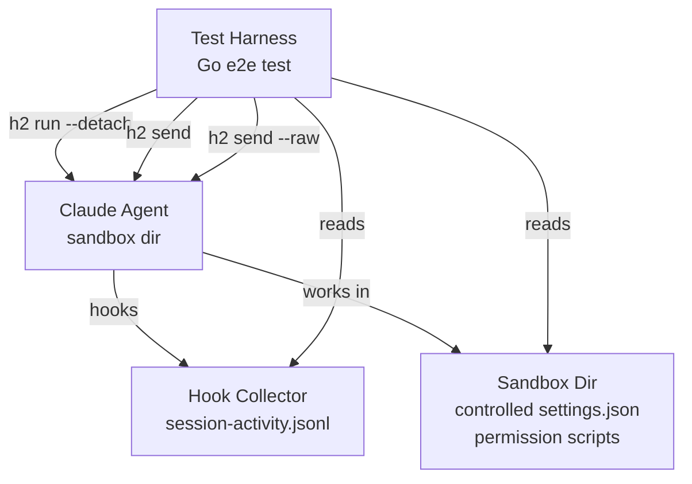
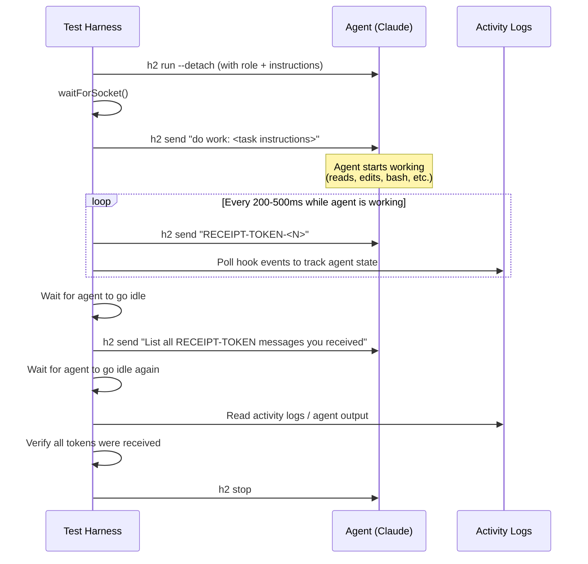

# Message Receipt Reliability E2E Test Suite

## Problem

Messages sent to agents via `h2 send` can be lost when the agent is in certain states: mid-tool-use, running background tasks, parallel tool calls, permission prompts, compaction, etc. The delivery loop (`RunDelivery`) writes directly to the agent's PTY, but Claude Code may not always incorporate the text into its context depending on its internal state when the text arrives.

We need a systematic test suite that verifies message receipt across all agent activity states and all message priority modes.

## Architecture



### Test Flow Per Scenario



## Test Infrastructure

### Sandbox Setup

Each test creates an isolated environment:

```
<tmpDir>/
  .h2/
    roles/<role>.yaml
    claude-config/default/
      settings.json          # hooks + permission config
      CLAUDE.md              # agent instructions
    sessions/<agent>/
  project/                   # working directory for the agent
    files for the agent to work on
  permission-script.sh       # configurable permission behavior
```

### Permission Script Variants

The permission script controls how fast/slow permission decisions are, and what decision is made. It is referenced from the role's `settings.json` as the `PermissionRequest` hook handler.

```bash
#!/bin/bash
# fast-allow.sh — immediate allow
echo '{"behavior": "allow"}'

# slow-allow.sh — simulates review delay
sleep 1.5
echo '{"behavior": "allow"}'

# ask-user.sh — forces user permission prompt
echo '{}'  # empty = fall through to ask_user

# deny.sh — deny the tool call
echo '{"behavior": "deny"}'
```

### Token Sending Strategy

Each test sends uniquely identifiable tokens at regular intervals:

- Token format: `RECEIPT-<testName>-<seqNum>-<timestamp>`
- Interval: 200-500ms (configurable per test)
- Sent via a background goroutine while the agent is working
- The goroutine stops when the agent goes idle

### Verification Methods

Two complementary verification approaches:

1. **Log-based (primary)**: Scan `session-activity.jsonl` for `UserPromptSubmit` hook events. Each delivered message triggers a `UserPromptSubmit` since it's typed into the PTY + Enter. Count how many RECEIPT tokens appear in the logs vs how many were sent.

2. **Agent query (secondary)**: After the work is done, send a message asking the agent to list all RECEIPT tokens it saw. Compare against sent list. This is less deterministic but catches cases where the message was delivered to the PTY but not incorporated into context.

### Helper Functions

```go
// sendTokens sends RECEIPT tokens at the given interval until stop is closed.
// Returns the list of tokens that were sent.
func sendTokens(t *testing.T, h2Dir, agentName, testName string,
    interval time.Duration, priority string, stop <-chan struct{}) []string

// waitForIdle polls agent status until it reports idle state.
func waitForIdle(t *testing.T, h2Dir, agentName string, timeout time.Duration)

// collectReceivedTokens scans session-activity.jsonl for UserPromptSubmit
// events containing RECEIPT tokens.
func collectReceivedTokens(t *testing.T, h2Dir, agentName string) []string

// verifyReceipt compares sent vs received tokens, reports missing ones.
func verifyReceipt(t *testing.T, sent, received []string)

// createPermissionScript writes a permission script with the given behavior.
func createPermissionScript(t *testing.T, dir string, behavior string, delay time.Duration) string

// createWorkFiles creates files in the project dir for the agent to work on.
func createWorkFiles(t *testing.T, projectDir string, count int)
```

## Test Scenarios

### Group 1: Basic Message Delivery

**Test: NormalPriority_AgentIdle**
- Agent is idle (no work assigned yet)
- Send 20 normal-priority tokens at 300ms intervals
- Verify: all 20 received
- Purpose: baseline — if this fails, nothing else will work

**Test: NormalPriority_AgentThinking**
- Give agent a complex prompt (e.g., "analyze these 5 files and write a summary")
- While agent is in the thinking phase (between tool calls), send 10 tokens at 500ms
- Verify: all 10 received

**Test: InterruptPriority_AgentWorking**
- Agent is doing file reads/edits
- Send 10 interrupt-priority tokens at 300ms
- Verify: all 10 received (interrupt should always get through)

**Test: IdlePriority_AgentIdle**
- Agent goes idle after initial work
- Send 10 idle-priority tokens at 300ms
- Verify: all 10 received

**Test: IdlePriority_AgentBusy**
- Agent is actively working
- Send 10 idle-priority tokens at 300ms
- After agent goes idle, verify: all 10 eventually received

**Test: IdleFirstPriority_Ordering**
- Agent is working
- Send tokens A, B, C, D, E as idle-first priority
- After agent goes idle, verify: received in reverse order (E, D, C, B, A) since idle-first prepends

### Group 2: Tool Use States

**Test: DuringBashExecution_Fast**
- Instruct agent to run several fast bash commands (ls, cat, echo)
- Send tokens during the bash execution phase
- Verify: all received

**Test: DuringBashExecution_Slow**
- Instruct agent to run a bash command that takes 5-10 seconds (e.g., `sleep 5 && echo done`)
- Send tokens every 500ms during the slow command
- Verify: all received

**Test: DuringBackgroundBash**
- Instruct agent to run a bash command in background (`run_in_background: true`)
- Send tokens while the background command is running
- Verify: all received

**Test: DuringFileReads**
- Instruct agent to read 10+ files sequentially
- Send tokens during the read burst
- Verify: all received

**Test: DuringFileEdits**
- Instruct agent to make edits to several files
- Send tokens during edits
- Verify: all received

**Test: DuringParallelToolCalls**
- Instruct agent to do something that triggers parallel tool calls (e.g., "read these 3 files" which Claude often parallelizes)
- Send tokens during the parallel execution
- Verify: all received

### Group 3: Permission States

**Test: DuringPermissionPrompt_FastAllow**
- Configure permission script with fast allow (immediate)
- Instruct agent to run bash commands (triggers permission)
- Send tokens during the permission flow
- Verify: all received

**Test: DuringPermissionPrompt_SlowAllow**
- Configure permission script with 1.5s delay before allow
- Send tokens during the delay
- Verify: all received (messages should queue and deliver after permission resolves)

**Test: DuringPermissionPrompt_AskUser**
- Configure permission script to return ask_user (agent blocks)
- Send normal-priority tokens while blocked — these should be held
- Send interrupt-priority tokens while blocked — these should get through
- Use `h2 send --raw "y"` to unblock
- After unblock, verify: all tokens eventually received

**Test: DuringPermissionPrompt_Deny**
- Configure permission script to deny
- Send tokens during the brief denial period
- Verify: all received after agent recovers

### Group 4: Agent Subprocesses and Background Work

**Test: DuringSubagentExecution**
- Instruct agent to use the Task tool to spawn a subagent
- Send tokens while the subagent is running
- Verify: all received by the parent agent

**Test: DuringBackgroundTask_WithPolling**
- Instruct agent to start a background bash task and poll it with TaskOutput
- Send tokens during the polling loop
- Verify: all received

**Test: DuringTaskList_MultiStep**
- Instruct agent to create a task list (TaskCreate) and work through items
- Send tokens throughout the multi-step workflow
- Verify: all received

### Group 5: Compaction

**Test: DuringCompaction**
- Trigger compaction via `h2 send --raw "/compact"` (no need to fill context)
- Send tokens before, during, and after compaction
- Use PreCompact hook event to detect compaction start
- Use SessionStart to detect compaction end
- Verify: tokens sent before compaction received, tokens sent during compaction are queued and delivered after SessionStart

### Group 6: Mixed Priority Under Load

**Test: MixedPriorities_Concurrent**
- Agent is actively working
- Simultaneously send tokens at all 4 priority levels from separate goroutines
- Verify: all tokens eventually received
- Verify: interrupt tokens were delivered first (check ordering in logs)

**Test: HighVolume_BurstSend**
- Agent is working
- Send 50 tokens in a rapid burst (50ms intervals)
- Verify: all 50 received (tests queue capacity and delivery throughput)

**Test: RawMessage_DuringPermission**
- Agent is blocked on permission
- Send raw messages (`--raw`) to type responses
- Verify: raw text was delivered to PTY without prefix

### Group 7: Edge Cases

**Test: MessageDuringAgentStartup**
- Send messages immediately after `h2 run --detach`, before agent is fully initialized
- Verify: messages are queued and delivered once agent is ready

**Test: LongMessage_FileReference**
- Send messages longer than 300 chars (triggers file reference path)
- Verify: agent receives `Read <filepath>` instruction and reads the file

**Test: MessageAfterCompaction_ContextRebuild**
- After compaction, agent re-reads files (context rebuild)
- Send tokens during the rapid Read burst post-compaction
- Verify: all received

## Implementation Details

### File Location

```
e2etests/
  message_reliability_test.go    # test cases
  message_reliability_helpers.go # shared helpers (sendTokens, waitForIdle, etc.)
```

### Role Configuration

```yaml
name: receipt-test
agent_type: claude
model: haiku    # fast + cheap for testing
permission_mode: default
instructions: |
  You are a test agent. When you receive messages containing RECEIPT-TOKEN,
  acknowledge them silently and continue your current work. Do not stop
  working to respond to RECEIPT-TOKEN messages.

  When asked to list all RECEIPT-TOKEN messages, list every one you remember
  seeing, one per line.
```

### Test Timeout Strategy

- Individual token send: 5s timeout
- Agent idle wait: 120s timeout (agents can be slow)
- Full test timeout: 5 minutes
- Use `t.Parallel()` where safe (each test has its own sandbox)

### Cost Management

- Use `model: haiku` for all tests (cheapest, fastest)
- Keep work instructions minimal but sufficient to trigger the target state
- Run expensive tests (compaction, high-volume) only when `-tags reliability` is set
- Quick smoke tests (Group 1) run by default

### Build Tags

```go
//go:build reliability

package e2etests
```

Most tests should be gated behind a `reliability` build tag since they're slow and use real API calls. A subset of Group 1 tests can run without the tag as smoke tests.

## Metrics and Reporting

Each test should log:
- Number of tokens sent
- Number of tokens received
- Token loss rate (%)
- Agent states observed during token sending (from activity logs)
- Time distribution of token delivery (sent timestamp vs UserPromptSubmit timestamp)

This data helps identify patterns: e.g., "tokens sent during bash execution have 5% loss rate" vs "tokens sent during permission prompts have 20% loss rate."

## Follow-up Work

Once the test suite identifies specific failure modes:
1. File bugs for each failure pattern with reproduction steps
2. Fix the delivery loop or queue handling for each case
3. Add regression tests for each fix
4. Consider adding a delivery acknowledgment protocol (agent echoes received message IDs)
