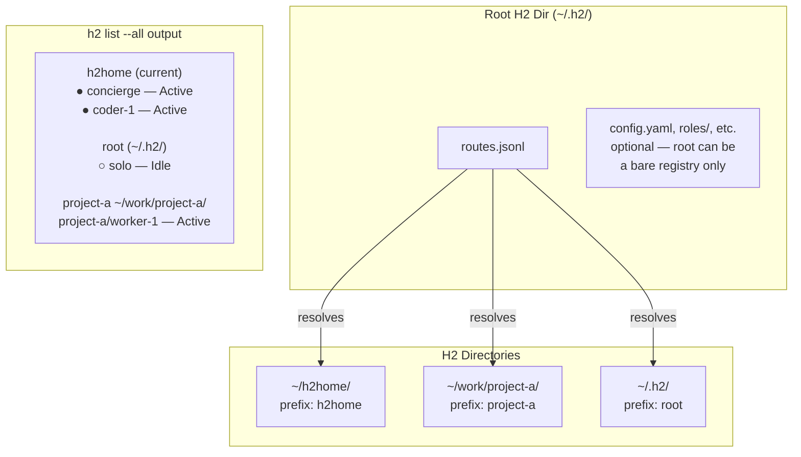
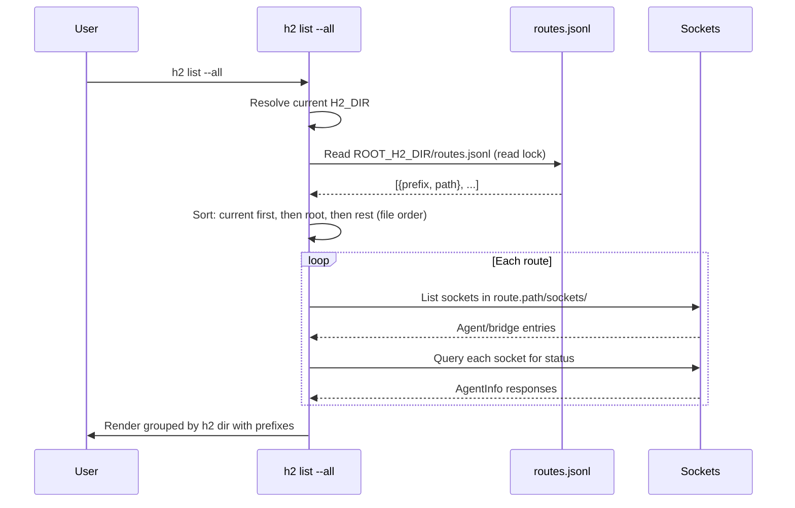

# Root H2 Dir and Routes Registry

## Overview

Replace the BFS directory-walking discovery in `h2 list --all` with a deterministic route registry. Introduce a **root h2 dir** (defaults to `~/.h2/`) that holds a `routes.jsonl` file mapping prefixed names to h2 directory paths. Every `h2 init` registers itself in this file. `h2 list --all` reads the registry instead of scanning the filesystem.

## Architecture



### h2 list --all Display Flow



## routes.jsonl Format

```jsonl
{"prefix": "root", "path": "/Users/dcosson/.h2"}
{"prefix": "h2home", "path": "/Users/dcosson/h2home"}
{"prefix": "project-a", "path": "/Users/dcosson/work/project-a"}
```

Each line is a self-contained JSON object. The file uses JSONL (one JSON object per line) for simple append-friendly operations.

**Fields:**
- `prefix` — unique short name for this h2 directory. Used in `h2 list --all` output as `<prefix>/agent-name`. The root h2 dir always uses `"root"`.
- `path` — absolute path to the h2 directory.

## Detailed Design

### Root H2 Dir

The root h2 dir is the central registry location. It defaults to `~/.h2/` and can be overridden via the `H2_ROOT_DIR` environment variable (should rarely be needed).

The root h2 dir may or may not be a fully initialized h2 directory itself:
- **Bare registry**: `~/.h2/` contains only `routes.jsonl`. No roles, sessions, sockets, etc. This happens when the user sets up h2 in a different location and hasn't initialized `~/.h2/`.
- **Full h2 dir**: `~/.h2/` is both the root registry and a working h2 directory with roles, sessions, etc. It gets the special prefix `"root"` in routes.jsonl.

```go
// RootDir returns the root h2 directory.
// Checks H2_ROOT_DIR env var, falls back to ~/.h2/.
func RootDir() string
```

### h2 init Changes

When `h2 init <path>` is called:

1. Create the h2 directory structure as today (unchanged).
2. Resolve the root h2 dir.
3. Ensure `<root>/routes.jsonl` exists (create if not).
4. Acquire a write lock on `routes.jsonl`.
5. Determine the prefix:
   - If `--prefix <name>` is provided, use it. If that prefix already exists in routes.jsonl, **fail with an error**.
   - Otherwise, default to the directory basename (e.g., `/Users/dcosson/h2home` → `"h2home"`).
   - If that basename conflicts, try `<basename>-2`, `<basename>-3`, etc.
   - If the path being initialized IS the root h2 dir, use the prefix `"root"`.
6. Append the new route entry to `routes.jsonl`.
7. Release the lock.

```
h2 init ~/h2home                    → prefix "h2home"
h2 init ~/h2home --prefix mysetup   → prefix "mysetup"
h2 init                             → initializes ~/.h2/, prefix "root"
h2 init --global                    → initializes ~/.h2/, prefix "root"
```

### File Locking

Use filesystem-level advisory locks on `routes.jsonl` to prevent corruption from concurrent `h2 init` calls:

```go
// internal/config/routes.go

// AcquireRoutesLock takes an exclusive lock on routes.jsonl for writing.
func AcquireRoutesLock(rootDir string) (*flock.Flock, error)

// AcquireRoutesReadLock takes a shared lock for reading.
func AcquireRoutesReadLock(rootDir string) (*flock.Flock, error)
```

Use the `github.com/gofrs/flock` package (or similar) for cross-platform file locking. The lock file can be `routes.jsonl.lock` alongside the routes file.

### h2 list --all Changes

Replace `ResolveDirAll()` (the BFS sibling-scanning approach) with a simple registry read:

```go
// ResolveDirAllFromRoutes reads routes.jsonl and returns all registered h2 directories.
func ResolveDirAllFromRoutes() ([]Route, error) {
    rootDir := RootDir()
    // Acquire read lock
    // Read and parse routes.jsonl
    // Return routes (preserving file order for non-special entries)
}
```

**Display ordering in `h2 list --all`:**
1. **Current** — the h2 dir resolved for the current working directory. Marked with `(current)`. Agents listed without prefix.
2. **Root** — the root h2 dir (if it's different from current and is a full h2 dir). Listed with `root/` prefix.
3. **Others** — remaining h2 dirs in the order they appear in `routes.jsonl`. Listed with `<prefix>/` prefix.

**Example output:**
```
h2home ~/h2home (current)
  Agents
    ● concierge (concierge) claude — Active (thinking) 5s, up 2h, 30k in / 15k out $3.20
    ● coder-1 (coding) claude — Active (tool use: Bash) 1m, up 4h, 80k in / 20k out $8.50
  Bridges
    ● dcosson (telegram) — up 6h

root ~/.h2
  Agents
    ○ solo (default) claude — Idle 30m, up 1h, 5k in / 2k out $0.50

project-a ~/work/project-a
  Agents
    ● project-a/worker-1 (coding) claude — Active 10s, up 30m, 10k in / 5k out $1.20
```

### h2 send Cross-Directory (Future)

With prefixed names, we lay the groundwork for cross-directory messaging:
```bash
h2 send project-a/worker-1 "How's the build going?"
```

This is not part of the current scope but the prefix system enables it naturally.

## Implementation

### New Files

- `internal/config/routes.go` — Route struct, read/write routes.jsonl, locking, prefix resolution
- `internal/config/routes_test.go` — Unit tests

### Modified Files

| File | Change |
|------|--------|
| `internal/config/config.go` | Add `RootDir()`. Remove or deprecate `ResolveDirAll()`. |
| `internal/cmd/init.go` | Register route in routes.jsonl after creating h2 dir. Add `--prefix` flag. |
| `internal/cmd/init_test.go` | Test route registration, prefix conflicts, auto-increment. |
| `internal/cmd/ls.go` | Rewrite `listAll()` to use routes registry. Update display to show prefixes. |

### Data Types

```go
// Route represents an entry in routes.jsonl.
type Route struct {
    Prefix string `json:"prefix"`
    Path   string `json:"path"`
}

// ReadRoutes reads and parses routes.jsonl from the root h2 dir.
// Takes a read lock. Returns empty slice if file doesn't exist.
func ReadRoutes(rootDir string) ([]Route, error)

// RegisterRoute appends a route to routes.jsonl.
// Takes a write lock. Validates prefix uniqueness.
func RegisterRoute(rootDir string, route Route) error

// ResolvePrefix generates a unique prefix for a new h2 dir.
// Checks for conflicts and auto-increments if needed.
func ResolvePrefix(rootDir string, desired string) (string, error)
```

### Code to Remove

- `ResolveDirAll()` in `config.go` (lines 163-234) — the BFS sibling-scanning discovery
- Related tests in `config_test.go` (lines 394-554)

## Testing

### Unit Tests (routes_test.go)

- `TestReadRoutes_Empty` — returns empty slice when file doesn't exist
- `TestReadRoutes_ParsesEntries` — correctly parses multi-line JSONL
- `TestRegisterRoute_AppendsToFile` — new route appended to end
- `TestRegisterRoute_RejectsExistingPrefix` — explicit prefix conflict fails
- `TestResolvePrefix_Default` — uses directory basename
- `TestResolvePrefix_AutoIncrement` — conflicts get -2, -3, etc.
- `TestResolvePrefix_RootDir` — root h2 dir gets "root" prefix
- `TestConcurrentRegistration` — two goroutines registering simultaneously don't corrupt file
- `TestRootDir_EnvOverride` — H2_ROOT_DIR env var works
- `TestRootDir_Default` — defaults to ~/.h2/

### Unit Tests (init_test.go additions)

- `TestInitCmd_RegistersRoute` — h2 init creates route entry
- `TestInitCmd_PrefixFlag` — --prefix flag sets custom prefix
- `TestInitCmd_PrefixConflict` — explicit prefix conflict fails init
- `TestInitCmd_RootInit` — h2 init with no args registers as "root"

### Unit Tests (ls_test.go additions)

- `TestListAll_UsesRoutes` — reads from routes.jsonl instead of BFS
- `TestListAll_CurrentFirst` — current h2 dir listed first
- `TestListAll_PrefixedNames` — non-current agents show prefix/name
- `TestListAll_CurrentNoPrefixes` — current dir agents have no prefix

## Migration

When `h2 list --all` finds no `routes.jsonl`, it should fall back gracefully:
1. If the current h2 dir exists, list just that one.
2. Log a hint: "Run `h2 init` to register this directory for cross-directory discovery."

No automatic migration from the old BFS discovery — users re-run `h2 init` on their existing directories to register them. This is simpler and avoids guessing.
